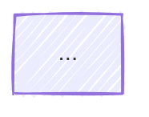

# ToolGUI docs

The [mdBook](https://rust-lang.github.io/mdBook/) source for the ToolGUI book.

Lives in this repository so an API change and its documentation land in the
same pull request.

## Build

```shell
cargo install mdbook mdbook-mermaid   # or grab binaries from their releases
mdbook-mermaid install .              # once, writes the gitignored mermaid runtime
mdbook serve                          # http://localhost:3000, reloads on save
mdbook build                          # static site, into book/
```

`mdbook-mermaid` renders the ```` ```mermaid ```` blocks. `install` writes the
mermaid runtime that `book.toml` points at; it is gitignored rather than
committed, so run it once after cloning or `mdbook build` fails on the missing
files. Re-run it after upgrading `mdbook-mermaid` to refresh them.

## Examples

`demos/` is a Go package, one file per component, holding the example each
component's page shows. The book slices a snippet out of it:

```
{{#include ../../../demos/title.go:demo}}
```

and `cmd/toolgui-demo` runs the function around that same snippet and prints
the same slice beside what it drew. So there is one copy of every example, and
what the book shows is what the demo runs -- `/demo/#/title` is the page for
the component the reader is looking at.

Adding an example means a file in `demos/`, a line in `demos/registry.go`, and
an `{{#include}}` in the component's page. `go test ./cmd/toolgui-demo` checks
the two ends still meet: an include with no anchor behind it, or an anchor
nothing shows, fails there rather than silently in the built page — mdBook
leaves an unresolved include in the page as the directive it was written as.

## Diagrams

Most diagrams are ```` ```mermaid ```` blocks, drawn in the hand-drawn look:

````

````

The Server-Client architecture diagram is laid out by hand instead, because
dagre will not keep its two layers apart. Its source is
`src/architecture/server-client.excalidraw`: open it at
[excalidraw.com](https://excalidraw.com), move things, then `File` → `Export
image` → `SVG`, with background off, over `src/architecture/server-client.svg`.
Save the scene back over the `.excalidraw` too, so the two stay in step.

Export in light mode only. `diagrams.css` inverts the SVG for the dark themes,
which is the same filter Excalidraw's own dark export writes.

## Publishing

`.github/workflows/docs.yml` publishes to GitHub Pages from `main`, which the
Release workflow points at the latest release. So the published book describes
the released API, not `dev`; read `docs/src` on GitHub for the unreleased
state.
