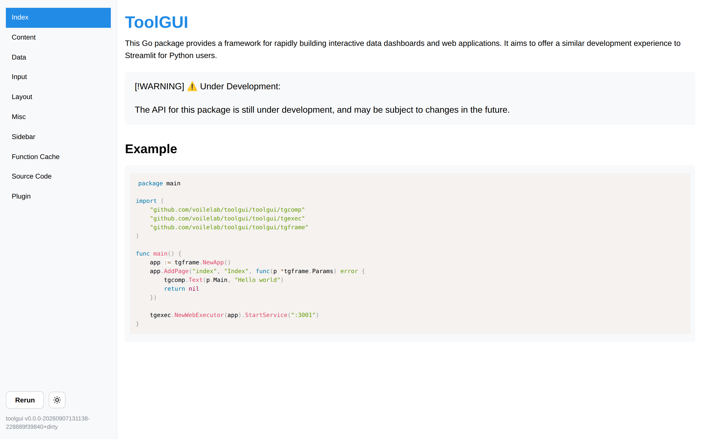

# Page



## Parameters

We can config the page's:

1. Name: Or ID. The name of the page should be unique.
In the web GUI provider, the name of a page will be used as the path of the page.

2. Title: In the web GUI provider,
the title of a page will be used as the title of the page and the text of its link in the side nav.

3. Emoji: Optional. The emoji will be used as an icon in the side nav and browser favicon.
An [emoji shortcode](../components/content/emoji.md) works here too.

4. Hidden: Optional. A hidden page is kept off the [side nav](sidenav.md) list.
It is served like any other page: a link to its url still lands on it, and the
nav shows it while it is the page being read. For a page something else links
to — a detail page, a page an iframe embeds — rather than one a visitor picks
off the list.

The config type in package is:

```go
type PageConfig struct {
	Name   string `json:"name"`
	Title  string `json:"title"`
	Emoji  string `json:"emoji"`
	Hidden bool   `json:"hidden,omitzero"`
}
```

## Page Function

The function signature of **Page Function** is defined as:

```go
type RunFunc func(p *Params) error
```

Where `Params` contains these parameters to operate the page:

```go
type Params struct {
	Context context.Context

	State   *State
	Main    *Container
	Sidebar *Container

	Query url.Values
}
```

`Main` and `Sidebar` is the root container component of the main and sidebar part
shown in the layout image.

We can show a text in the Main container by:

```go
tgcomp.Text(p.Main, "Hello")
```

The `State` in `Params` provided for

1. The component that need to pass state. For example: the checked state of checkbox.
2. The state that user need to store. For example: The todo items in the Todo App.

## Page query

`Query` is the page query the page was opened with. It sits right after the
page name, wherever the name is:

| Mode | URL | `Query` |
| --- | --- | --- |
| Web, path mode | `/detail?group=a` | `group=a` |
| Web, hash mode | `/#/detail?group=a` | `group=a` |
| Browser build | `/?embed=1#/detail?group=a` | `group=a` |

The real query string in hash mode (`?embed=1`) is the app's, not the page's.
On the desktop there is no address bar, and the query comes from a
[Page Link](../components/content/page_link.md).

`Query` is never nil: a page opened without a query gets an empty one. Each run
gets its own copy. It stays the same for every run until the page calls
`ReplaceQuery`.

**It is untrusted input.** Anyone can build a link and send it to a user.
Validate what you read: look a value up in a known set, and never use it as a
path, a command or SQL without checking it. The framework never writes it into
the `State`. To seed an input from it, set the input's default; once the user
picks something, the state wins:

```go
func Detail(p *tgframe.Params) error {
	group := p.Query.Get("group")

	conf := &tgcomp.SelectConf{}
	if def := slices.Index(groups, group); def >= 0 {
		conf.SetDefault(def)
	}
	idx := tgcomp.Select(p.Sidebar, "Group", groups, conf)
	...
}
```

A query over 8 KiB encoded (`tgframe.MaxQuerySize`) is refused: the page does
not open, the same as a page name the app does not have.

To link to a page with a query, use
[Page Link](../components/content/page_link.md).

### Writing the query back

`ReplaceQuery` writes the user's choice back into the address bar, so a copied
URL opens the page as it is now:

```go
q := url.Values{}
if idx != nil {
	q.Set("group", groups[*idx])
}
p.ReplaceQuery(q)
```

* No reload, no new session, and no history entry: Back still leaves the page.
* It replaces the whole page query. Pass every key you want to keep.
* It takes effect when the run ends. A run cut by a newer event changes
  nothing, and the last call of a run wins.
* Later runs read the new value as `Query`, and so does a reconnect.
* Over 8 KiB encoded, it fails the run (`run.err`) and the address bar stays.
* On the desktop there is no address bar; the query is only kept in memory.

### Opening another page

`Navigate` opens another page from code, as a click on a
[Page Link](../components/content/page_link.md) would. Use it when there is
nothing to click, such as a DataFrame row picked:

```go
sel := tgcomp.DataFrame(p.Main, head, rows,
	&tgcomp.DataFrameConf{Selection: tgcomp.SelectionModeSingle})
if len(sel) == 1 {
	p.Navigate("detail", url.Values{"id": {ids[sel[0]]}})
}
```

* The new page gets a new session and a new state, and a history entry: Back
  returns here.
* It takes a page name of this app, never a URL. An unknown page or a query
  over 8 KiB fails the run, and the page stays.
* It takes effect when the run ends. A run cut by a newer event goes nowhere,
  the last call of a run wins, and it wins over `ReplaceQuery`.

### Testing

In a test, open the page with `tgtest.WithQuery`, read what `ReplaceQuery`
left with `Page.Query`, and where `Navigate` went with `Page.Navigated`:

```go
p := tgtest.Open(t, app, "detail", tgtest.WithQuery(url.Values{
	"group": {"a"},
}))
p.GetByLabel("Group").Select(2)
p.Query().Get("group") // "c"

page, q, ok := p.Navigated() // "detail", id=0004, true
```

## Interrupting a run

A page function runs again on every event, and the run before it is cut short.
`Context` is how that reaches the work the page does: it is cancelled when a
new event arrives, or when the session closes.

Hand it to anything slow, and the user moving on stops the work instead of
leaving it to finish into a screen nobody is looking at:

```go
func Main(p *tgframe.Params) error {
	req, err := http.NewRequestWithContext(p.Context, "GET", url, nil)
	if err != nil {
		return err
	}

	resp, err := http.DefaultClient.Do(req)
	...
}
```

A page function that ignores `Context` is still interrupted, but only at the
next component it draws — a run that computes for a while without drawing
anything holds the next event until it gets there.

Returning the cancellation is fine: a cut run reports nothing to the client,
since the run replacing it is about to paint the screen anyway, and it leaves
the components of the last finished run in place — a click or an upload naming
one of them still lands.

## Example for adding a page

* No emoji icon

```go
app.AddPage("index", "Index", Main)
```

* With a emoji icon

```go
app.AddPageByConfig(&tgframe.PageConfig{
	Name:  "page2",
	Title: "Page2",
	Emoji: "🔄",
}, Page2)
```

* Reached by url, not off the nav

```go
app.AddPageByConfig(&tgframe.PageConfig{
	Name:   "page3",
	Title:  "Page3",
	Hidden: true,
}, Page3)
```

## Page name in the URL

By default the web executor serves each page at its own path, `/{name}`, and
redirects `/` to the first page added.

An app served from a static path — or opened from a file — cannot rely on the
server routing those paths. `SetHashPageNameMode` moves the page name into the
URL fragment, `/#/{name}`, so every page is served from `/`:

```go
app.SetHashPageNameMode(true)
```

The fragment starts with `#/`, not a bare `#`. For a page named `novel`:

```text
http://localhost:3000/#/novel   ✓ opens novel
http://localhost:3000/#novel    ✗ not a page link
```

With no fragment, the first page added is shown.
