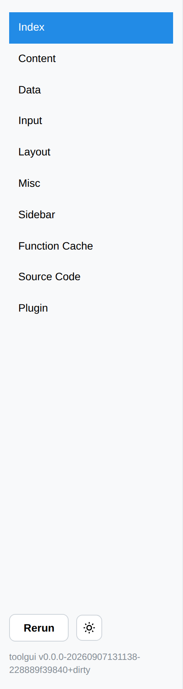

# Side Nav

The side nav is the left column of the app.



It holds four parts, top to bottom:

1. The page list: one link per page in the App. The link of the current page is
   highlighted, and a page's emoji is shown in front of its title.
2. The page's [Sidebar container](../components/layout/container.md), when the
   page func puts anything in it.
3. The app controls:
   * Rerun: Rerun the Page Func without changing any state.
   * Dark/Light Mode Switch: Switch the theme of the app.
   * A spinner, shown while the app is running the Page Func.
4. The toolgui version the app was built against.

On a narrow screen the column collapses behind a `Menu` button.

## Version

The version line reads the module version out of the binary's build info, so an
app that depends on a released toolgui shows that tag with nothing to configure.
A binary built from inside the toolgui repo has no such entry, and falls back to
the version recorded in the source at release time.

Hide it with:

```go
app.SetShowVersion(false)
```

