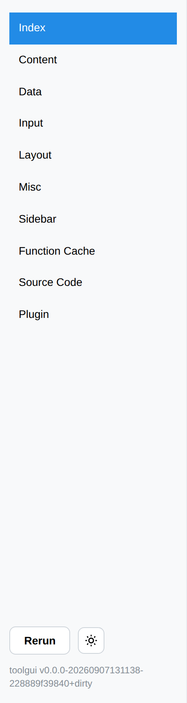

# Side Nav

The side nav is the left column of the app.



It holds four parts, top to bottom:

1. The page list: one link per page in the App. The link of the current page is
   highlighted, and a page's emoji is shown in front of its title. A page the
   App declares [Hidden](page.md) is left off the list, except while it is the
   page being read. When the list would hold only the page being read -- a
   single-page app -- it is left out.
2. The page's [Sidebar container](../components/layout/container.md), when the
   page func puts anything in it.
3. The app controls:
   * Rerun: Rerun the Page Func without changing any state.
   * Dark/Light Mode Switch: Switch the theme of the app. Until it is used,
     the app follows the browser's `prefers-color-scheme`; the choice is
     remembered afterwards.
   * A spinner, shown while the app is running the Page Func.
4. The toolgui version the app was built against. Click it for the
   [About](#about) dialog.

The page list is the part that scrolls: an app with more pages than the
column is tall gets a scrollbar on the list, and the sidebar, the controls
and the version line under it keep their place.

On a narrow screen the column collapses behind a `Menu` button. What the
button opens is a bar that fits the screen: the list is capped there too, so
the controls under it are where they can be reached rather than below every
link the app has.

## Shared selection

A choice that belongs to every page -- a group picked in the sidebar -- can
follow the user from page to page. Declare its query key sticky:

```go
app.SetStickyQuery("group")
```

The page list then copies `group` from the current page query into the page
it opens, and so does a [PageLink](../components/content/page_link.md) that
does not set `group` itself. Other keys are left behind. Each page keeps its
choice in the URL with `p.ReplaceQuery`, and reads it back from `p.Query`:

```go
var groups = []string{"a", "b", "c"}

// groupSelect draws the shared Select. Both pages call it.
func groupSelect(p *tgframe.Params) *int {
	// Untrusted: only a known group seeds the input.
	conf := &tgcomp.SelectConf{}
	if def := slices.Index(groups, p.Query.Get("group")); def >= 0 {
		conf.SetDefault(def)
	}
	idx := tgcomp.Select(p.Sidebar, "Group", groups, conf)

	q := url.Values{}
	if idx != nil {
		q.Set("group", groups[*idx])
	}
	p.ReplaceQuery(q)
	return idx
}

func Summary(p *tgframe.Params) error {
	if idx := groupSelect(p); idx != nil {
		tgcomp.Text(p.Main, "Summary of "+groups[*idx])
	}
	return nil
}

func Detail(p *tgframe.Params) error {
	if idx := groupSelect(p); idx != nil {
		tgcomp.Text(p.Main, "Detail of "+groups[*idx])
	}
	return nil
}

func main() {
	app := tgframe.NewApp()
	app.AddPage("summary", "Summary", Summary)
	app.AddPage("detail", "Detail", Detail)
	app.SetStickyQuery("group")
	// ...
}
```

Pick `b` on Summary and the link to Detail reads `/detail?group=b`, so Detail
opens with `b` selected. The links are real URLs: a middle-click opens the
page in a new tab with the same group. It works the same in hash mode, wasm
and Wails; Wails just has no address bar to show it.

## Width

Drag the column's right edge to resize it, between 180px and 480px. The handle
is also a keyboard control: focus it and the arrow keys move the edge in 16px
steps, `Home` and `End` go to the bounds, and `Enter` — or a double click —
puts it back to the default 240px.

The button at the top of the column collapses it to just that button, handing
the whole width to the page; the page's Sidebar container keeps its state while
hidden. Both the width and the collapsed state are remembered in the browser,
so they survive moving between pages.

Neither applies on a narrow screen, where the column is a bar across the top
and the `Menu` button owns it.

## Version

The version line reads the module version out of the binary's build info, so an
app that depends on a released toolgui shows that tag with nothing to configure.
A build off an untagged checkout shows the pseudo-version the toolchain derives
from the commit, `v0.0.0-{date}-{revision}`.

Only a build whose info names no commit at all falls back to a version recorded
in the source: `go run`, a tree with no VCS metadata, or `-buildvcs=false`,
which the wails CLI passes on every build. A release records its own tag there;
anything built off `dev` reports `v0.0.0-unknown` rather than claiming a release
it is not.

Hide it with:

```go
app.SetShowVersion(false)
```

## About

Clicking the version line opens an About dialog: the app's own introduction
on top, then the toolgui version with a link to its repo and docs. ESC or the
close button dismisses it.

Set the introduction, in markdown, with:

```go
app.SetAbout("# My Tool\nConverts CSV to JSON.")
```

With `SetShowVersion(false)` the line reads `About` and the dialog shows only
the introduction; with neither, the line is gone.
