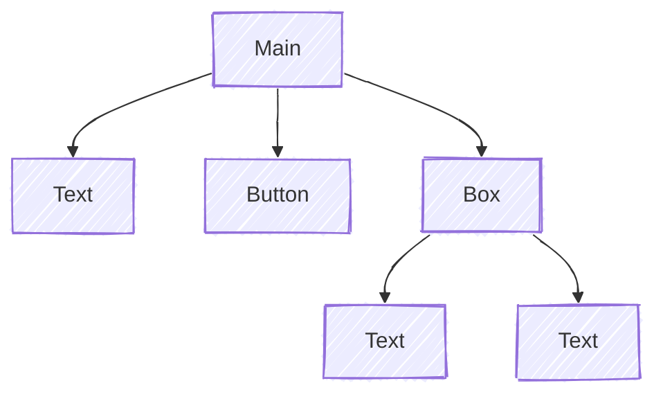

# Components

## Component Tree / Forest

When every component created, we need to assign **where it should generate**.
The root will be Main Container or Sidebar Container.
Hence the relation between components is trees.

For example, if a page function implements as:

```go
tgcomp.Text(p.Main, "Text")
tgcomp.Button(p.Main, "Button")
box := tgcomp.Box(p.Main)
tgcomp.Text(box, "Text1")
tgcomp.Text(box, "Text2")
```

Then the **Component Tree** will be:



## One shape for every component

Every component reads the same way: the container first, then whatever the
component is for, then an optional conf.

```go
func Text(c *tgframe.Container, text string, conf ...*TextConf)
func Button(c *tgframe.Container, label string, conf ...*ButtonConf) bool
func Select(c *tgframe.Container, label string, items []string, conf ...*SelectConf) *int
```

The conf is variadic so that the common call carries nothing:

```go
tgcomp.Button(p.Main, "Save")
tgcomp.Button(p.Main, "Save", &tgcomp.ButtonConf{ID: "save_all", Disabled: true})
```

Zero or one conf; two is a mistake rather than something to merge, and panics
with the component's name in the message. An explicit `nil` means the same as
none.

Every conf embeds [`tgframe.Base`](https://pkg.go.dev/github.com/voilelab/toolgui/toolgui/tgframe#Base),
which is where its `ID` comes from — the field is not declared per component,
and the framework reads it through the embed rather than through a getter per
conf.

```go
type Base struct{ ID string }

type ButtonConf struct {
	tgframe.Base
	Color    tcutil.Color
	Disabled bool
}
```

### Go version

Writing `&ButtonConf{ID: "save_all"}` — a promoted field as a key in a
composite literal — needs the **calling file** to be at language version Go
1.27 or above. That is the only version-dependent thing a user of toolgui
touches. A module still on 1.26 spells the same thing out:

```go
&tgcomp.ButtonConf{Base: tgframe.Base{ID: "save_all"}}
```

toolgui's own `go.mod` says `go 1.27.1`, so a module that depends on it is
already above that line; the nested spelling is there for a project that
lowers its own `go` directive per file or per package.

## Identity: position and id

A page function runs again from the top on every interaction and writes every
component again. Two questions follow from that, and they have different
answers.

**Which component is this, across runs?** Its position. A container counts the
components written into it, so the second component in the main container is
`container_component_container_main/1` on every run, whatever it contains.
Nothing compares content, so writing the same thing twice is fine:

```go
tgcomp.Text(p.Main, "same")
tgcomp.Text(p.Main, "same")
```

Both render. A component that keeps its position keeps its identity, so its
props are updated in place instead of it being torn down and rebuilt.

**Where is this component's state stored?** Its id, derived from the
component's type and its label: `Button(c, "Save")` is `button_component_Save`.
A component claims one when it holds state, whether that state lives in Go —
every input component — or only in the browser: `Tab` remembers which tab is
open, `Expand` whether it is open, `JSON` which nodes are collapsed, and
`Iframe` sends events back.

Components that only display something — `Text`, `Markdown`, `Divider`,
`Title`, `Table` and the rest — have no id at all unless you give them one.

An id is a name, so two components cannot share one. Two identical buttons
have the same id and the page fails with `duplicated component id`:

```go
tgcomp.Button(p.Main, "Save")
tgcomp.Button(p.Main, "Save")   // error
```

Give one of them its own id to tell them apart. There is one way to do that,
and every component takes it: `Conf.ID`.

```go
tgcomp.Button(p.Main, "Save")
tgcomp.Button(p.Main, "Save", &tgcomp.ButtonConf{ID: "save_all"})

tgcomp.Expand(p.Main, "Details", false)
tgcomp.Expand(p.Main, "Details", false, &tgcomp.ExpandConf{ID: "second_details"})

tgcomp.Text(p.Main, "Value: 3", &tgcomp.TextConf{ID: "count_result"})
```

The display components take it the same way, which is what to reach for when a
test or a stylesheet needs to name one in particular. So do the layout
components: `Box`, `Column`, `Form` and the rest are configured through their
conf like everything else, and the containers they hand out derive their ids
from theirs.

An id given this way is also the element's id in the DOM.
