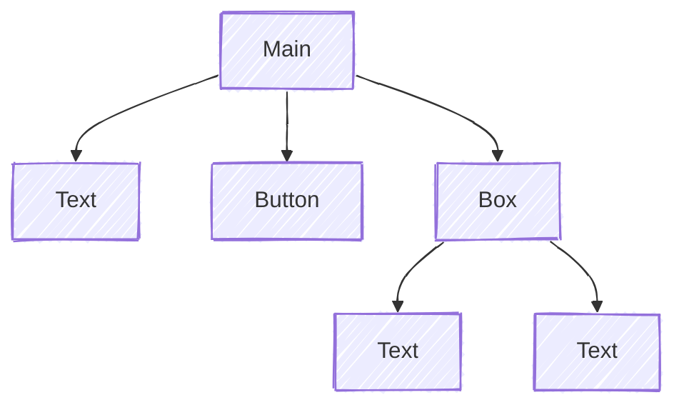

# Components

## Component Tree / Forest

When every component created, we need to assign **where it should generate**.
The root will be Main Container or Sidebar Container.
Hence the relation between components is trees.

For example, if a page function implements as:

```go
tgcomp.Text(p.Main, "Text")
tgcomp.Button(p.Main, "Button")
box := tgcomp.Box(p.Main)
tgcomp.Text(box, "Text1")
tgcomp.Text(box, "Text2")
```

Then the **Component Tree** will be:



## One shape for every component

Every component reads the same way: the container first, then whatever the
component is for, then an optional conf.

```go
func Text(c *tgframe.Container, text string, conf ...*TextConf)
func Button(c *tgframe.Container, label string, conf ...*ButtonConf) bool
func Select(c *tgframe.Container, label string, items []string, conf ...*SelectConf) *int
```

The conf is variadic so that the common call carries nothing:

```go
tgcomp.Button(p.Main, "Save")
tgcomp.Button(p.Main, "Save", &tgcomp.ButtonConf{ID: "save_all", Disabled: true})
```

Zero or one conf; two is a mistake rather than something to merge, and panics
with the component's name in the message. An explicit `nil` means the same as
none.

Every conf embeds [`tgframe.Base`](https://pkg.go.dev/github.com/voilelab/toolgui/toolgui/tgframe#Base),
which is where its `ID` comes from — the field is not declared per component,
and the framework reads it through the embed rather than through a getter per
conf.

```go
type Base struct{ ID string }

type ButtonConf struct {
	tgframe.Base
	Color    tcutil.Color
	Disabled bool
}
```

### Go version

Writing `&ButtonConf{ID: "save_all"}` — a promoted field as a key in a
composite literal — needs the **calling file** to be at language version Go
1.27 or above. That is the only version-dependent thing a user of toolgui
touches, and toolgui's own `go.mod` says `go 1.27.1`, so a module that
depends on it is already above that line.

## What a component hands back

Most components hand back what the user did — `Button` a `bool`, `Textbox` a
`*string` — or nothing at all. The few that hand back something the page
function operates *later* follow one rule, so that a caller wrapping toolgui
in an abstraction of its own knows what to expect and can name the type:

* A place the page can write and write over is a **slot**, `*XxxSlot`, and is
  written through `With` and emptied through `Clear`.
* Something whose only follow-up is one teardown is a **`func()`**: call it,
  and the component is gone.
* Anything else is a **handle**, `*XxxHandle`, with named methods for what it
  can do. The one that takes it off the page, where there is one, is `Remove`.

Every one of these types is exported, so a handle can be declared as a
variable, kept in a struct field, passed to a function, and named in an
interface.

| Component | Hands back | Finished with |
| --- | --- | --- |
| `Empty` | `*EmptySlot` | `With` / `Clear` |
| `Spinner` | `func()` | call it |
| `Status` | `*StatusHandle` | `Complete` / `Fail` |
| `ProgressBar` | `*ProgressBarHandle` | `Remove` |

`Container` is not one of these words. `Box`, `Column`, `Form` and `Expand`
hand out a `*tgframe.Container`, which is a place components are *added* to, as
many as the page function likes. A slot is written whole and rewritten whole,
and a handle is neither — which is why `EmptyContainer` is now `EmptySlot` and
`StatusContainer` is now `StatusHandle`. The old names stay as deprecated type
aliases, so code that uses them still compiles; new code should not use them.

`Status.Error` is likewise now `Status.Fail`, with `Error` kept and deprecated:
the old name reads like the `error` interface, which a status does not
implement. Both take at most one closing label — two or more is a mistake
rather than something to join, and panics, the way passing two confs does.

## Identity: position and id

A page function runs again from the top on every interaction and writes every
component again. Two questions follow from that, and they have different
answers.

**Which component is this, across runs?** Its position. A container counts the
components written into it, so the second component in the main container is
`container_component_container_main/1` on every run, whatever it contains.
Nothing compares content, so writing the same thing twice is fine:

```go
tgcomp.Text(p.Main, "same")
tgcomp.Text(p.Main, "same")
```

Both render. A component that keeps its position keeps its identity, so its
props are updated in place instead of it being torn down and rebuilt.

**Where is this component's state stored?** Its id, derived from the
component's type and its label: `Button(c, "Save")` is `button_component_Save`.
A component claims one when it holds state, whether that state lives in Go —
every input component — or only in the browser: `Tab` remembers which tab is
open, `Expand` whether it is open, `JSON` which nodes are collapsed, and
`Iframe` sends events back.

Components that only display something — `Text`, `Markdown`, `Divider`,
`Title`, `Table` and the rest — have no id at all unless you give them one.

An id is a name, so two components cannot share one. Two identical buttons
have the same id and the page fails with `duplicated component id`:

```go
tgcomp.Button(p.Main, "Save")
tgcomp.Button(p.Main, "Save")   // error
```

Give one of them its own id to tell them apart. There is one way to do that,
and every component takes it: `Conf.ID`.

```go
tgcomp.Button(p.Main, "Save")
tgcomp.Button(p.Main, "Save", &tgcomp.ButtonConf{ID: "save_all"})

tgcomp.Expand(p.Main, "Details", false)
tgcomp.Expand(p.Main, "Details", false, &tgcomp.ExpandConf{ID: "second_details"})

tgcomp.Text(p.Main, "Value: 3", &tgcomp.TextConf{ID: "count_result"})
```

The display components take it the same way, which is what to reach for when a
test or a stylesheet needs to name one in particular. So do the layout
components: `Box`, `Column`, `Form` and the rest are configured through their
conf like everything else, and the containers they hand out derive their ids
from theirs.

An id given this way is also the element's id in the DOM.

## Writing one place more than once

A page function normally writes each place once per run. A slot — what
[`Empty`](../components/layout/empty.md) hands out, and what `Spinner` and
`Status` are built on — is the exception: it can be written, cleared and
written again while the run is still going, so the page can show "querying…"
and then replace it with the result.

A slot keeps **one key** across every write. Clearing it sends a delete for
that key, and the client drops the node and the subtree under it; the next
write creates a node there again. The alternative — a fresh key per write —
would save the delete, but it would leave the client holding a node per write
until the run ended, and it would move the slot's contents in the tree every
time, so nothing inside could keep anything across a redraw.

Keeping the key means an id written into the slot is claimed again on the next
write, and an id is a name that only one component may hold. So clearing a
slot **gives its ids back**: what was in it is off the screen, and the id is
free for the next write to claim.

```go
slot := tgcomp.Empty(p.Main)
for range names {
	// The same id every time, and no `duplicated component id`: each
	// textbox is gone before the next one is written.
	slot.With(func(c *tgframe.Container) {
		tgcomp.Textbox(c, "Name")
	})
}
```

An id that is given back and never claimed again names nothing on the page by
the end of the run, so the state under it is dropped. That is the point: a
widget cleared out of a slot should not hand its old value to whatever lands
on its id next run. An id that *is* claimed again — the common case, where the
slot is rewritten with the same widget — keeps its state, because the claim
takes it back off the released list.

Two things follow for a page function. The container a slot's `With` hands
over is only good until the next `With` or `Clear`, so take it in the callback
rather than keeping it. And a slot starts empty on every run, whatever the
last run left in it, so the first write of a run is not stacked on the last
write of the one before.
