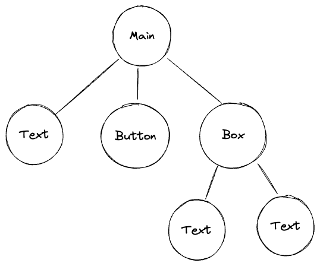

# Components

## Component Tree / Forest

When every component created, we need to assign **where it should generate**.
The root will be Main Container or Sidebar Container.
Hence the relation between components is trees.

For example, if a page function implements as:

```go
tgcomp.Text(p.Main, "Text")
tgcomp.Button(p.State, p.Main, "Button")
box := tgcomp.Box(p.Main, "box")
tgcomp.Text(box, "Text1")
tgcomp.Text(box, "Text2")
```

Then the **Component Tree** will be:



## Identity: position and id

A page function runs again from the top on every interaction and writes every
component again. Two questions follow from that, and they have different
answers.

**Which component is this, across runs?** Its position. A container counts the
components written into it, so the second component in the main container is
`container_component_container_main/1` on every run, whatever it contains.
Nothing compares content, so writing the same thing twice is fine:

```go
tgcomp.Text(p.Main, "same")
tgcomp.Text(p.Main, "same")
```

Both render. A component that keeps its position keeps its identity, so its
props are updated in place instead of it being torn down and rebuilt.

**Where is this component's state stored?** Its id, derived from the
component's type and its label: `Button(s, c, "Save")` is
`button_component_Save`. A component claims one when it holds state, whether
that state lives in Go — every input component — or only in the browser:
`Tab` remembers which tab is open, `Expand` whether it is open, `JSON` which
nodes are collapsed, and `Iframe` sends events back. `Column`, `Box` and
`Form` take an id as an argument.

Components that only display something — `Text`, `Markdown`, `Divider`,
`Title`, `Table` and the rest — have no id at all unless you give them one.

An id is a name, so two components cannot share one. Two identical buttons
have the same id and the page fails with `duplicated component id`:

```go
tgcomp.Button(p.State, p.Main, "Save")
tgcomp.Button(p.State, p.Main, "Save")   // error
```

Give one of them its own id to tell them apart. Every component that claims
an id can be named, through an id argument, a `WithID` variant or `Conf.ID`:

```go
tgcomp.Button(p.State, p.Main, "Save")
tgcomp.ButtonWithConf(p.State, p.Main, "Save", &tgcomp.ButtonConf{ID: "save_all"})

tgcomp.Expand(p.Main, "Details", false)
tgcomp.ExpandWithID(p.Main, "Details", false, "second_details")
```

The components that display something take one the same way, when you want to
name one for a test or a stylesheet: `TextWithID`, `TitleWithID`,
`MarkdownWithID` and the rest. `Table` is the one that takes no id.

An id given this way is also the element's id in the DOM, which is what to
reach for when a test or a stylesheet needs to name one component in
particular.
