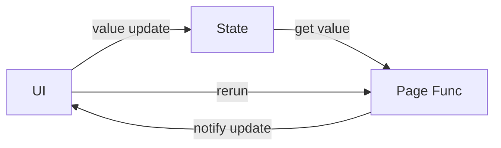
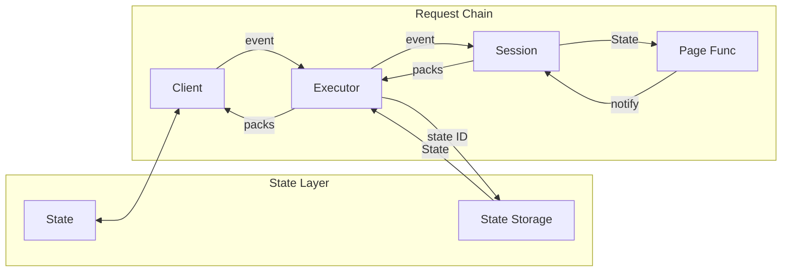

# How it works?

## Basic



The key concept is that in the **Page Function**,
the UI component interact immediately with the running logic.

For example:

```go
if tgcomp.Button(p.State, p.Main, "Click me") {
    tgcomp.Text(p.Main, "Hi")
}
```

In the first call (For example: When the web page is entering.),
The `Click me` button will render, but the `Hi` will not render.
Since the button is not clicked in the first round.

When the user clicks the button, the **Page Function** will be called again.
In this round, `tgcomp.Button` will return `true` and `Hi` will render.

How?

Since we declare a button whose id is `Click me`, and when the button is clicked,
we store `true` with key `Click me` into `p.State`.

When entering `tgcomp.Button`, it will check if there is any data stored
in `p.State` with key `Click me`.

## Server-Client Architecture



Server-Client need to handle a more complex part: multiple state for multiple users.
Hence we need a `state_id` for each state.

The executor owns the transport and the state pool — how long a state lives in
it is on [Session Cache](session-cache.md). Everything from the event onwards
is the Session's, and it is the same on the desktop.

`packs` is what travels back: a ready pack when a run starts, one notify pack
per component change, and a result pack when the run ends.

File upload is the one thing off this path. The client POSTs to `/api/files`
with its `state_id` and the `component_id` of the fileupload, and the handler
streams the body to a file of the state's own, so it touches neither the socket
nor the Session. The page reads that file back through
[Fileupload](../components/input/fileupload.md), which means an upload only
has to fit on disk, not in memory.

## Session

The piece that turns an event into a page run is `tgframe.Session`.
It holds a page name, a `State`, and one function to send packs to the client:

```go
func NewSession(app *App, pageName string, state *State, send SendPackFunc) (*Session, error)
```

That is all it needs, so it does not know what the transport is.
An executor only feeds it events:

```go
session.HandleRawEvent(bs)
```

A `Session` is safe for concurrent use and serializes its runs: a new event
interrupts the page func still running from the previous one, so the client
never receives two runs interleaved. The interrupted run panics with
`ErrUpdateInterrupt`, which the session recovers.

This is why the web executor and the
[desktop executor](../hello-world/desktop.md) share the whole app logic. They
differ only in how packs and events travel: a websocket and a `state_id` pool on
the web, bound methods on a single window on the desktop.
