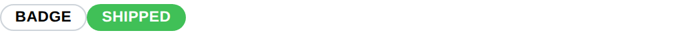

# Badge

Badge component displays a short label, for a status or a tag next to other
content.

The text supports [emoji shortcodes](emoji.md).

## API

```go
func Badge(c *tgframe.Container, text string, conf ...*BadgeConf)
```

* `c` is Parent container.
* `text` is the badge text.
* `conf` is an optional configuration, at most one.

```go
// BadgeConf is the configuration for the Badge component.
type BadgeConf struct {
	tgframe.Base // ID

	// Color is the color of the badge. Default is tcutil.ColorNull, which
	// leaves it neutral.
	Color tcutil.Color
}
```

`Color` is one of `tcutil.ColorInfo`, `ColorSuccess`, `ColorWarning` or
`ColorDanger`.

## Example

```go
tgcomp.Badge(p.Main, "Badge")
tgcomp.Badge(p.Main, "Shipped", &tgcomp.BadgeConf{Color: tcutil.ColorSuccess})
```


