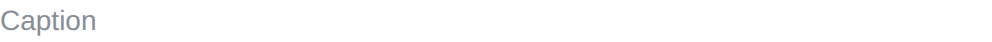

# Caption

Caption component displays a small dimmed text, for a note next to what it
explains.

The text supports [emoji shortcodes](emoji.md).

## API

```go
func Caption(c *tgframe.Container, text string, conf ...*CaptionConf)
```

* `c` is Parent container.
* `text` is the caption text.
* `conf` is an optional configuration, at most one.

```go
// CaptionConf is the configuration for the Caption component.
type CaptionConf struct {
	tgframe.Base // ID
}
```

## Example

```go
tgcomp.Table(p.Main, []string{"a", "b"}, [][]string{{"1", "2"}})
tgcomp.Caption(p.Main, "Sampled hourly, UTC.")
```


