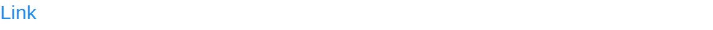

# Link

Link component display a link.

The link text supports [emoji shortcodes](emoji.md), the url does not.

## API

```go
func Link(c *tgframe.Container, text, url string, conf ...*LinkConf)
```

* `c` is Parent container.
* `text` is the link text.
* `url` is the link url.
* `conf` is an optional configuration, at most one.

```go
// LinkConf is the configuration for the Link component.
type LinkConf struct {
	tgframe.Base // ID
}
```

## Example

```go
tgcomp.Link(p.Main, "Link", "https://www.example.com/")
```


