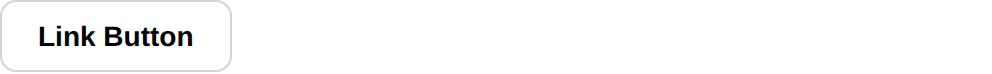

# Link Button

Link Button component displays a link drawn as a button.

It navigates rather than reporting a click, so unlike
[Button](../input/button.md) it returns nothing and keeps no state. It is a
link in the page too: it opens in a new tab on a middle click, and its url can
be copied.

The text supports [emoji shortcodes](emoji.md), the url does not.

## API

```go
func LinkButton(c *tgframe.Container, text, url string, conf ...*LinkButtonConf)
```

* `c` is Parent container.
* `text` is the button text.
* `url` is the url to navigate to.

`LinkButtonConf`:

| Field   | Description                                                       | Default   |
| ------- | ----------------------------------------------------------------- | --------- |
| `Color` | `tcutil.ColorInfo`, `ColorSuccess`, `ColorWarning` or `ColorDanger`. | neutral |
| `ID`    | A user specific element id.                                        | derived   |

## Example

```go
tgcomp.LinkButton(p.Main, "Link Button", "https://www.example.com/")
```


