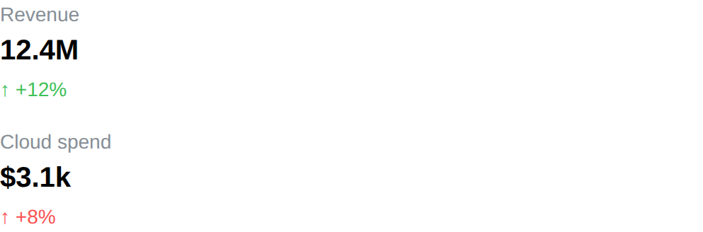

# Metric

Metric component displays a labelled value, with an optional delta under it:
the number card of a dashboard.

The label and the value support [emoji shortcodes](emoji.md).

## API

```go
func Metric(c *tgframe.Container, label, value string, conf ...*MetricConf)
```

* `c` is Parent container.
* `label` is the name of the metric.
* `value` is the value, already formatted the way it should be shown.
* `conf` is an optional configuration, at most one.

```go
// MetricConf is the configuration for the Metric component.
type MetricConf struct {
	tgframe.Base // ID

	// Delta is the change shown under the value, e.g. "+12%" or "-3.2k".
	// Hidden when empty.
	Delta string

	// DeltaColorInverse paints an increase red and a decrease green.
	DeltaColorInverse bool
}
```

A delta that starts with `-` is a decrease, and is drawn in red with a down
arrow; anything else is an increase, drawn in green with an up arrow. Set
`DeltaColorInverse` for a metric where growing is the bad news — cost,
latency, churn — and the two colors swap. The arrow follows the sign either
way, so the direction still reads without the color.

## Example

```go
tgcomp.Metric(p.Main, "Revenue", "12.4M", &tgcomp.MetricConf{Delta: "+12%"})
tgcomp.Metric(p.Main, "Cloud spend", "$3.1k",
	&tgcomp.MetricConf{Delta: "+8%", DeltaColorInverse: true})
```


