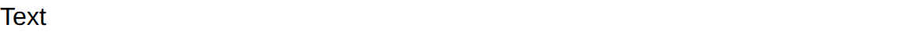

# Text

Text component display a text.

The text supports [emoji shortcodes](emoji.md): `:tada:` renders as 🎉.

## API

```go
func Text(c *tgframe.Container, text string, conf ...*TextConf)
```

* `c` is Parent container.
* `text` is the text.
* `conf` is an optional configuration, at most one.

```go
// TextConf is the configuration for the Text component.
type TextConf struct {
	tgframe.Base // ID
}
```

## Example

```go
tgcomp.Text(p.Main, "Text")
```

```go
tgcomp.Text(p.Main, "Text", &tgcomp.TextConf{ID: "greeting"})
```


