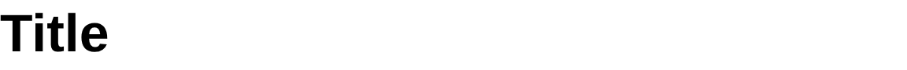

# Title

Title component display a title.

The text supports [emoji shortcodes](emoji.md): `:tada:` renders as 🎉.

## API

```go
func Title(c *tgframe.Container, text string, conf ...*TitleConf)
```

* `c` is Parent container.
* `text` is the title text.
* `conf` is an optional configuration, at most one.

```go
// TitleConf is the configuration for the Title component.
type TitleConf struct {
	tgframe.Base // ID
}
```

## Example

```go
tgcomp.Title(p.Main, "Title")
```


