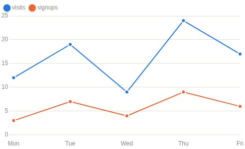

# Chart

Chart component draws a line, bar or area chart.

## API

```go
func LineChart(c *tgframe.Container, id string, labels []string, series []ChartSeries)
func BarChart(c *tgframe.Container, id string, labels []string, series []ChartSeries)
func AreaChart(c *tgframe.Container, id string, labels []string, series []ChartSeries)
func ChartWithConf(c *tgframe.Container, id string, conf *ChartConf)
```

* `c` is the parent container.
* `id` is the user specific id. It has to be unique in the page, and stable
  across runs: a chart that keeps its id is updated in place instead of being
  redrawn from scratch.
* `labels` are the x axis categories.
* `series` are the series to draw. Every series needs one value per label, or
  the call panics.

`ChartSeries`:

| Field    | Description                                        |
| -------- | -------------------------------------------------- |
| `Name`   | Shown in the legend and the tooltip.                |
| `Values` | One value per label, in the same order.             |
| `Color`  | Any CSS color, overriding the theme palette.        |

`ChartConf`:

| Field     | Description                                         | Default         |
| --------- | --------------------------------------------------- | --------------- |
| `Kind`    | `ChartKindLine`, `ChartKindBar` or `ChartKindArea`.  | `ChartKindLine` |
| `Labels`  | The x axis categories.                               | none            |
| `Series`  | The series to draw.                                  | none            |
| `Stacked` | Stack the series instead of drawing them side by side. | `false`       |
| `Height`  | CSS height of the chart.                             | `300px`         |
| `XLabel`  | Title of the x axis, hidden when empty.              | none            |
| `YLabel`  | Title of the y axis, hidden when empty.              | none            |

## Examples

### Line

```go
tgcomp.LineChart(p.Main, "traffic",
	[]string{"Mon", "Tue", "Wed", "Thu", "Fri"},
	[]tgcomp.ChartSeries{
		{Name: "visits", Values: []float64{12, 19, 9, 24, 17}},
		{Name: "signups", Values: []float64{3, 7, 4, 9, 6}},
	})
```



### Bar

```go
tgcomp.BarChart(p.Main, "stars",
	[]string{"Go", "Rust", "Python"},
	[]tgcomp.ChartSeries{
		{Name: "stars", Values: []float64{31, 24, 47}},
	})
```

### Stacked area

```go
tgcomp.ChartWithConf(p.Main, "revenue", &tgcomp.ChartConf{
	Kind:    tgcomp.ChartKindArea,
	Labels:  []string{"Q1", "Q2", "Q3", "Q4"},
	Series: []tgcomp.ChartSeries{
		{Name: "cloud", Values: []float64{4, 6, 5, 9}},
		{Name: "desktop", Values: []float64{2, 3, 4, 4}},
	},
	Stacked: true,
	YLabel:  "revenue",
})
```

## Notes

* **Values are `float64`, labels are strings.** A time axis is formatted into
  labels by the page function; there is no time scale.
* **Colors follow the theme.** Series get their color from a palette that is
  stepped for the light and the dark theme, in a fixed order. The palette has
  eight slots and is never cycled, so a chart with more than eight series has
  to set `ChartSeries.Color` on the rest.
* **Every point travels over the websocket on every run of the page
  function.** A few thousand points per chart is the practical ceiling;
  downsample before drawing more than that.
