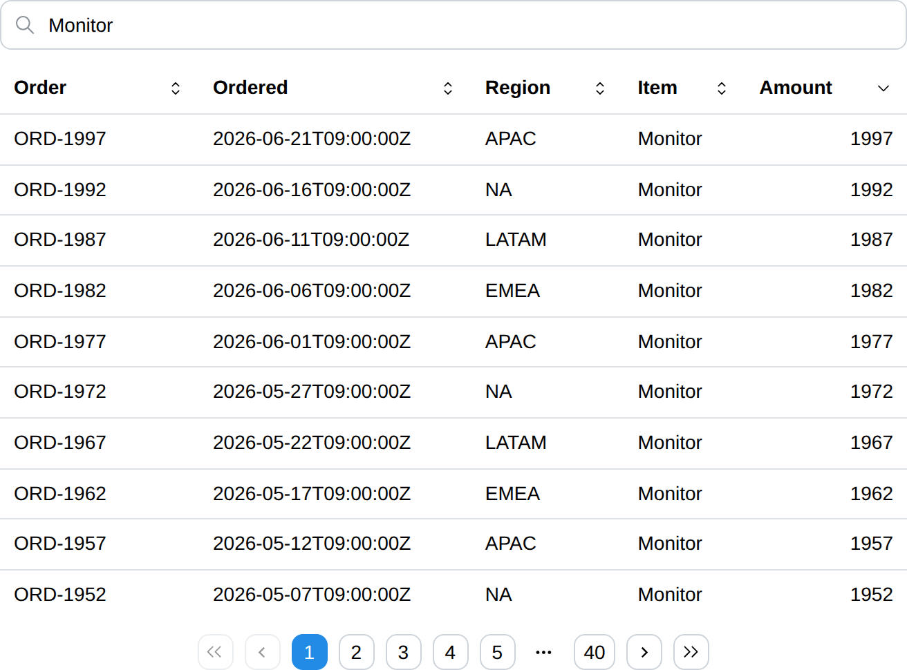

# DataFrame

DataFrame component displays a table the user can sort, search and page
through.

All three happen in the browser, so none of them reruns the page function.
`Table` is the static counterpart: reach for it when the rows are few and
already in the order they should be read in, and for `DataFrame` when the rows
are many, or when the reader — not the page function — should decide the order.

## API

```go
func DataFrame(c *tgframe.Container, head []string, rows [][]string, conf ...*DataFrameConf)
```

* `c` is Parent container.
* `head` is the head of table. It cannot be empty.
* `rows` is the body of table. Every row needs one cell per head entry;
  a row of any other length panics, the way a chart panics on a series that
  does not line up with its labels.
* `conf` is an optional configuration, at most one.

```go
// DataFrameConf is the configuration for the DataFrame component.
type DataFrameConf struct {
	tgframe.Base // ID

	// Sortable lets the user sort by clicking a column head, default on.
	// Set it with SetSortable.
	Sortable *bool

	// Searchable puts a search box above the table, default on.
	// Set it with SetSearchable.
	Searchable *bool

	// PageSize is how many rows one page holds, default 25.
	PageSize int

	// Height is the CSS height the table scrolls past (e.g. "400px").
	Height string

	// ColumnConf configures the columns, one entry per head entry.
	ColumnConf []DataFrameColumnConf
}
```

`Sortable` and `Searchable` are pointers so that leaving them out means on,
which is what a `DataFrame` is for. Turn one off through its setter:

```go
conf := (&tgcomp.DataFrameConf{}).SetSearchable(false)
```

Set `PageSize` above the row count to keep every row on one page. A negative
`PageSize` panics.

`Height` caps the table rather than fixing it: the page grows the table until
it reaches `Height`, and the rows scroll under a pinned head from there. Left
empty, the table is as tall as its page needs.

### Columns

```go
// DataFrameColumnConf is the configuration of one DataFrame column.
type DataFrameColumnConf struct {
	// Type is how the cells are read and sorted, default ColumnTypeText.
	Type ColumnType

	// Align is which edge the cells sit against, default ColumnAlignAuto.
	Align ColumnAlign

	// Width is the CSS width of the column (e.g. "8rem", "20%").
	Width string

	// Hidden drops the column from the table.
	Hidden bool
}
```

It is named after the component because `ColumnConf` is the layout
[Column](../layout/column.md)'s.

`ColumnConf` is either empty, leaving every column on its defaults, or exactly
as long as `head`. Any other length panics.

The rows stay a plain string matrix; `Type` is what tells the client how to
read them:

| `Type`              | Sorted by                                     |
| ------------------- | --------------------------------------------- |
| `ColumnTypeText`    | the string                                     |
| `ColumnTypeNumber`  | the numeric value, so `"10"` sorts after `"9"` |
| `ColumnTypeDatetime`| the instant named, RFC 3339 most reliably      |

A cell that does not parse as its column's type sorts last, whichever
direction the column is sorted in.

`ColumnAlignAuto` aligns a `ColumnTypeNumber` column right and every other one
left. `ColumnAlignLeft`, `ColumnAlignCenter` and `ColumnAlignRight` say so
outright.

A `Hidden` column is still searched, so a row can be found by a value it does
not show.

## Behaviour

Clicking a column head sorts ascending, clicking it again sorts descending,
and a third click drops the sort and gives the rows back in the order the page
function wrote them.

The search box keeps the rows holding what is typed, matched
case-insensitively against every cell of the row, hidden columns included.

Sorting, searching and paging are all client state. Nothing is sent to the
server, so the page function does not rerun and no other component on the page
is touched.

With no rows the head is still drawn, over a `No rows` message — which is also
what a search that matches nothing leaves behind.

### Large tables

**Paging, not virtual scrolling, is how a large `DataFrame` stays usable.**
Only `PageSize` rows are ever in the DOM, so what a sort or a keystroke has to
re-render is the page size and not the row count.

Measured on the demo grown to 10,000 rows, each configuration alone on the
page, taking the median of ten samples from click to painted frame:

| | `PageSize` 10 | every row on one page |
| --------------------------- | ------- | --------- |
| rows in the DOM             | 10      | 10,000    |
| page load, first row painted| 660 ms  | 2,922 ms  |
| sort                        | 31 ms   | 1,534 ms  |
| search keystroke            | 31 ms   | 596 ms    |
| page jump                   | 31 ms   | —         |

Scrolling is not what paging rescues: scrolling 4,800 px through all 10,000
rows dropped no frames either way (80 frames, median 16.7 ms, none over
25 ms), because the rows are laid out once and the browser scrolls them on the
compositor. What degrades without paging is **re-rendering** — a sort costs
1.5 s and every search keystroke close to 0.6 s, which is what makes an
unpaged table of this size unusable.

So take the advice above to set `PageSize` above the row count only for tables
of a few hundred rows at most.

Neither number is a server-side bound. The rows are sent whole — 10,000 rows
of this demo's five columns is a 573 KiB pack, the same either way — and are
filtered and sorted in full on every interaction. A table far past 10,000 rows
is worth paging on the server side instead.

## Example

```go
tgcomp.DataFrame(p.Main,
	[]string{"Order", "Ordered", "Region", "Item", "Amount"},
	orders,
	&tgcomp.DataFrameConf{
		ID:       "orders",
		PageSize: 10,
		ColumnConf: []tgcomp.DataFrameColumnConf{
			{Width: "9rem"},
			{Type: tgcomp.ColumnTypeDatetime},
			{},
			{},
			{Type: tgcomp.ColumnTypeNumber},
		},
	})
```


