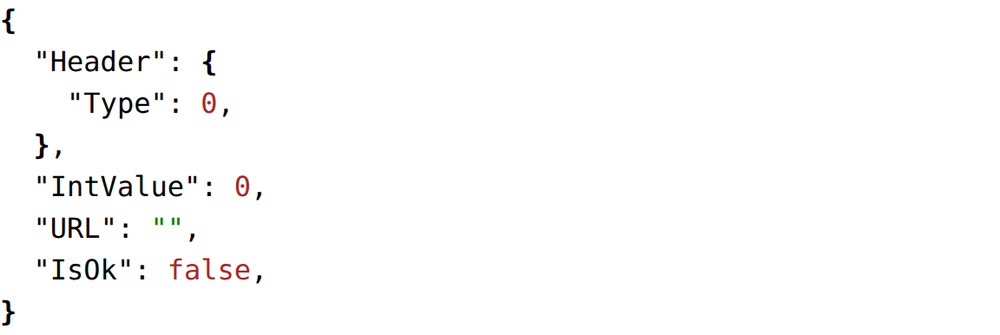

# JSON

JSON component display the JSON representation of an object.

## API

```go
func JSON(c *tgframe.Container, v any, conf ...*JSONConf)
```

* `c` is Parent container.
* `v` is the object.
  * string: assume to be a serialized JSON string.
  * other: assume to be a struct and will be converted to a JSON string.
* `conf` is an optional configuration, at most one.

```go
// JSONConf is the configuration for the JSON component.
type JSONConf struct {
	tgframe.Base // ID
}
```

The viewer keeps which nodes are collapsed, so the component claims an id of
its own: a hash of the value, unless `Conf.ID` gives it one. Two viewers over
the same value therefore need one of them to be named.

## Example

```go
type DemoJSONHeader struct {
	Type int
}

type DemoJSON struct {
	Header   DemoJSONHeader
	IntValue int
	URL      string
	IsOk     bool
}

tgcomp.JSON(p.Main, &DemoJSON{})
```


