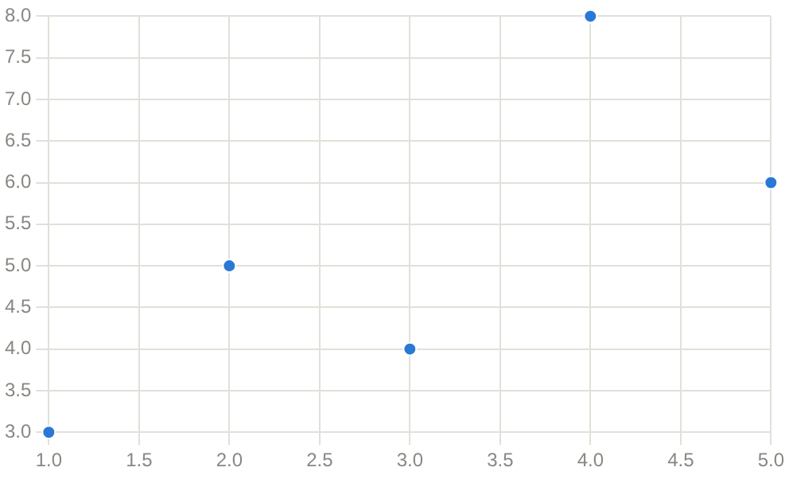

# Scatter Chart

Scatter Chart component draws one marker per point, on two value axes.

It is the one chart that takes points rather than labels and values: both of
its axes are value axes, so a point carries its own x. The rest of
[Chart](chart.md) applies unchanged — the id, the palette, `ChartConf`.

## API

```go
func ScatterChart(c *tgframe.Container, id string, series []ChartSeries)
```

* `c` is the parent container.
* `id` is the user specific id. It has to be unique in the page, and stable
  across runs: a chart that keeps its id is updated in place instead of being
  redrawn from scratch.
* `series` are the series to draw. Every series needs its `Points`, and no
  `Values`, or the call panics.

`ChartPoint`:

| Field | Description         |
| ----- | ------------------- |
| `X`   | Position on x axis. |
| `Y`   | Position on y axis. |

## Example

```go
tgcomp.ScatterChart(p.Main, "runs", []tgcomp.ChartSeries{
	{Name: "runs", Points: []tgcomp.ChartPoint{
		{X: 1, Y: 3}, {X: 2, Y: 5}, {X: 3, Y: 4},
		{X: 4, Y: 8}, {X: 5, Y: 6},
	}},
})
```



Axis titles and a height come from `ChartWithConf`, the same as the other
kinds:

```go
tgcomp.ChartWithConf(p.Main, "latency", &tgcomp.ChartConf{
	Kind:   tgcomp.ChartKindScatter,
	Series: []tgcomp.ChartSeries{{Name: "p95", Points: points}},
	XLabel: "concurrency",
	YLabel: "ms",
})
```
