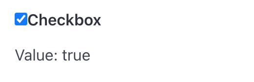

# Checkbox

Checkbox create a checkbox and return true if it's checked.

## API

### Interface

```go
func Checkbox(s *tgframe.State, c *tgframe.Container, label string) bool
func CheckboxWithConf(s *tgframe.State, c *tgframe.Container, label string, conf *CheckboxConf) bool
```

### Parameters

* `s` is State.
* `c` is Parent container.
* `label` is the text on checkbox.
* `conf` is the configuration of the checkbox.

```go
// CheckboxConf is the configuration for a checkbox.
type CheckboxConf struct {
	// Default is true if the checkbox is default checked.
	Default bool

	// Disabled is true if the checkbox is disabled.
	Disabled bool

	// ID is the ID of the checkbox.
	ID string
}
```

## Example

```go
checkboxValue := tgcomp.Checkbox(p.State, p.Main, "Checkbox")
if checkboxValue {
	tgcomp.TextWithID(p.Main, "Value: true", "checkbox_result")
} else {
	tgcomp.TextWithID(p.Main, "Value: false", "checkbox_result")
}
```


