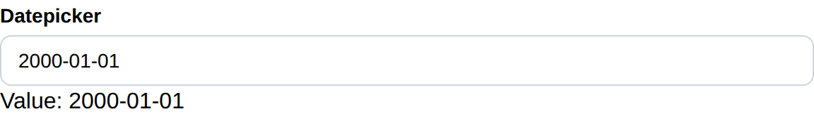

# Datepicker

Datepicker create a datepicker and return its selected date.

## API

```go
type Date struct {
	Year  int
	Month int
	Day   int
}

func Datepicker(c *tgframe.Container, label string, conf ...*DatepickerConf) *Date
```

* `c` is Parent container.
* `label` is the label for datepicker.
* `conf` is an optional configuration, at most one.
* Return the selected date. nil if no date is selected.

```go
// DatepickerConf is the configuration for the Datepicker component.
type DatepickerConf struct {
	tgframe.Base // ID

	// Default is the date the picker starts on. It is only read until the app
	// user first picks one, and a date that does not exist is ignored.
	Default *Date

	// Disabled is true if the datepicker is disabled.
	Disabled bool
}
```

## Example

```go
dateValue := tgcomp.Datepicker(p.Main, "Datepicker")
if dateValue != nil {
	text := fmt.Sprintf("Value: %04d-%02d-%02d",
		dateValue.Year, dateValue.Month, dateValue.Day)
	tgcomp.Text(p.Main, text, &tgcomp.TextConf{ID: "datepicker_result"})
}
```

Starting on a date, until the app user picks another:

```go
tgcomp.Datepicker(p.Main, "Datepicker", &tgcomp.DatepickerConf{
	Default: &tgcomp.Date{Year: 2026, Month: 9, Day: 8},
})
```

Clearing the picker is an answer of "no date": the return goes back to nil and
stays there, rather than falling back to `Default`.


