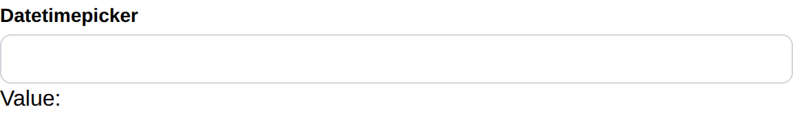

# Datetimepicker

Datetimepicker create a datetimepicker and return its selected datetime.

## API

```go
func Datetimepicker(c *tgframe.Container, label string, conf ...*DatetimepickerConf) *time.Time
```

* `c` is Parent container.
* `label` is the label for datetimepicker.
* `conf` is an optional configuration, at most one.
* Return the selected datetime. nil if no datetime is selected.

```go
// DatetimepickerConf is the configuration for the Datetimepicker component.
type DatetimepickerConf struct {
	tgframe.Base // ID
}
```

## Example

```go
dateValue := tgcomp.Datetimepicker(p.Main, "Datetimepicker")
if dateValue != nil {
	tgcomp.Text(p.Main, "Value: "+dateValue.Format("2006-01-02 15:04"),
		&tgcomp.TextConf{ID: "datetimepicker_result"})
}
```


