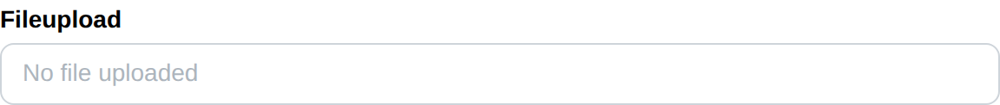

# Fileupload

Fileupload create a fileupload and return its selected file.

## API

```go
type FileObject struct {
	Name string `json:"name"`
	Type string `json:"type"`
	Size int    `json:"size"`
}

func (f *FileObject) Open() (tgframe.FileReader, error)
func (f *FileObject) Bytes() ([]byte, error)

func Fileupload(s *tgframe.State, c *tgframe.Container, label, accept string) *FileObject
```

* `s` is State.
* `c` is Parent container.
* `label` is the label for options group.
* `accept` is the file type to accept.
* Return the selected file object. nil if no file is selected.

The upload is streamed to disk rather than kept in memory, so a file only has
to fit on disk. `Size` is the size of what was stored.

* `Open` returns a reader over the content, which the caller closes. It reads
  at an offset too, so `archive/zip` and the image decoders can work straight
  off it.
* `Bytes` reads the whole file into memory. Prefer `Open` for anything that
  can work on a stream.

## Example

```go
fileObj := tgcomp.Fileupload(p.State, p.Main, "Fileupload", ".jpg,.png")
if fileObj != nil {
    tgcomp.Text(p.Main, "Fileupload filename: "+fileObj.Name)
    tgcomp.Text(p.Main, fmt.Sprintf("Fileupload bytes length: %d", fileObj.Size))
}
```

Reading the content through a stream:

```go
fp, err := fileObj.Open()
if err != nil {
    return err
}
defer fp.Close()

img, err := jpeg.Decode(fp)
```


