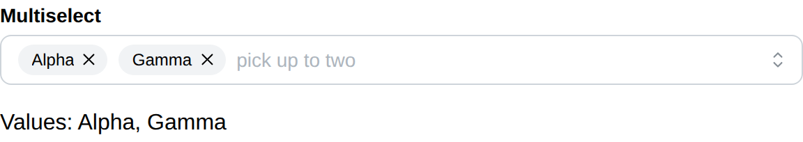

# Multiselect

Multiselect create a dropdown list that takes more than one item and return
the indices of the selected ones.

## API

```go
func Multiselect(c *tgframe.Container, label string, items []string, conf ...*MultiselectConf) []int
```

* `c` is Parent container.
* `label` is the label for multiselect.
* `items` is the list of options.
* `conf` is an optional configuration, at most one.
* Return the indices of the selected items, 0-indexed. Empty, never nil, when
  nothing is selected.

The result is ordered by `items` rather than by the order the app user picked
them in, so the same selection always reads the same way.

```go
// MultiselectConf is the configuration for the Multiselect component.
type MultiselectConf struct {
	tgframe.Base // ID

	// Default is the selection the component starts with, as indices into
	// items. It is only read until the app user first touches the component.
	Default []int

	// MaxSelections is how many items may be selected at once. Zero, the
	// default, is no limit. At the limit the frontend disables the items that
	// are not selected, so the limit is never reached by a refusal.
	MaxSelections int

	// Placeholder is the text shown while nothing is selected.
	Placeholder string

	// Disabled is true if the multiselect is disabled.
	Disabled bool
}
```

## Example

```go
envs := []string{"dev", "stage", "prod"}
selIndexes := tgcomp.Multiselect(p.Main, "Environments", envs,
	&tgcomp.MultiselectConf{
		Default:       []int{0},
		MaxSelections: 2,
		Placeholder:   "pick up to two",
	})

for _, idx := range selIndexes {
	tgcomp.Text(p.Main, "Selected: "+envs[idx])
}
```

Like a [Select](select.md), a multiselect derives its id from its label, so two
with the same label collide. Naming either of them is the way out:

```go
tgcomp.Multiselect(p.Main, "Pick", items)
tgcomp.Multiselect(p.Main, "Pick", items, &tgcomp.MultiselectConf{ID: "second_pick"})
```


