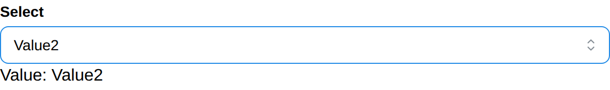

# Select

Select create a select dropdown list and return its selected value.

## API

```go
func Select(c *tgframe.Container, label string, items []string, conf ...*SelectConf) *int
```

* `c` is Parent container.
* `label` is the label for select.
* `items` is the list of options.
* `conf` is an optional configuration, at most one.
* Return the index of the selected item, 0-indexed. nil if no item is selected.

```go
// SelectConf is the configuration for the Select component.
type SelectConf struct {
	tgframe.Base // ID

	// Default is the item the select starts on, as an index into items,
	// 0-based like the return. It is only read until the app user first
	// touches the component, and one that points outside items is ignored.
	Default *int

	// Disabled is true if the select is disabled.
	Disabled bool
}

func (c *SelectConf) SetDefault(v int) *SelectConf
```

`Default` is 0-based like the return, so a `Default` of `0` starts on
`items[0]`. The state behind a select is 1-based — the frontend keeps its first
option for the placeholder — but that offset stays inside the component; see
[State Storage](../../architecture/state-storage.md) for the one place it
shows.

## Example

```go
values := []string{"Value1", "Value2"}
selIndex := tgcomp.Select(p.Main, "Select", values)
if selIndex != nil {
	tgcomp.Text(p.Main, fmt.Sprintf("Value: Value%d", *selIndex+1),
		&tgcomp.TextConf{ID: "select_result"})
}
```

Starting on the second item, until the app user picks another:

```go
tgcomp.Select(p.Main, "Select", values,
	(&tgcomp.SelectConf{}).SetDefault(1))
```

A select derives its id from its label, so two with the same label collide.
Naming either of them is the way out:

```go
tgcomp.Select(p.Main, "Pick", items)
tgcomp.Select(p.Main, "Pick", items, &tgcomp.SelectConf{ID: "second_pick"})
```


