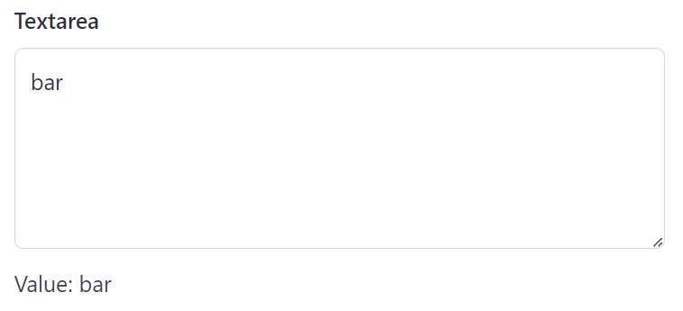

# Textarea

Textarea create a textarea and return its value.

## API

### Interface

```go
func Textarea(s *tgframe.State, c *tgframe.Container, label string) string
func TextareaWithConf(s *tgframe.State, c *tgframe.Container, label string, conf *TextareaConf) string
```

### Parameters

* `s` is State.
* `c` is Parent container.
* `label` is the label for textarea.
* `conf` is the configuration of the textarea.

```go
// TextareaConf is the configuration for a textarea.
type TextareaConf struct {
	// Height is the height of the textarea. default value is 3.
	Height int `json:"height"`

	// Default is the default value of the textarea.
	Default string `json:"default"`

	// Color defines the color of the textarea
	Color tcutil.Color

	// ID is the unique identifier for this textarea component
	ID string
}
```

## Example

```go
textareaValue := tgcomp.TextareaWithConf(p.State, p.Main, "Textarea",
	&tgcomp.TextareaConf{Height: 5})
tgcomp.TextWithID(p.Main, "Value: "+textareaValue, "textarea_result")
```


