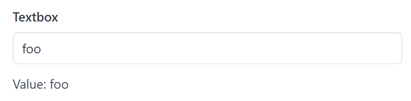

# Textbox

Textbox create a textbox and return its value.

## API

### Interface

```go
func Textbox(s *tgframe.State, c *tgframe.Container, label string) string
func TextboxWithConf(s *tgframe.State, c *tgframe.Container, label string, conf *TextboxConf) string
```

### Parameters

* `s` is State.
* `c` is Parent container.
* `label` is the label for textbox.
* `conf` is the configuration of the textbox.

```go
// TextboxConf is the configuration for the Textbox component
type TextboxConf struct {
	// Placeholder text to display in the textbox.
	Placeholder string

	// Maximum number of characters allowed in the textbox.
	// If 0, there is no character limit.
	MaxLength int

	// Indicates whether the textbox should mask input as asterisks.
	Password bool

	// Indicates whether the textbox should be disabled.
	Disabled bool

	// Default value of the textbox.
	Default string

	// Color defines the color of the textbox
	Color tcutil.Color

	// ID is the unique identifier for this textbox component
	ID string
}
```

## Example

```go
textboxValue := tgcomp.Textbox(p.State, p.Main, "Textbox")
tgcomp.TextWithID(p.Main, "Value: "+textboxValue, "textbox_result")
```


