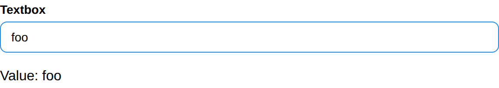

# Textbox

Textbox create a textbox and return its value.

## API

### Interface

```go
func Textbox(c *tgframe.Container, label string, conf ...*TextboxConf) string
```

### Parameters

* `c` is Parent container.
* `label` is the label for textbox.
* `conf` is an optional configuration, at most one.

```go
// TextboxConf is the configuration for the Textbox component
type TextboxConf struct {
	tgframe.Base // ID

	// Placeholder text to display in the textbox.
	Placeholder string

	// Maximum number of characters allowed in the textbox.
	// If 0, there is no character limit.
	MaxLength int

	// Indicates whether the textbox should mask input as asterisks.
	Password bool

	// Indicates whether the textbox should be disabled.
	Disabled bool

	// Default value of the textbox.
	Default string

	// ResetKey drops the app user's input and restores Default whenever it
	// changes, e.g. a hash of the file the text was filled from.
	ResetKey string

	// Color defines the color of the textbox
	Color tcutil.Color
}
```

## Example

```go
{{#include ../../../demos/textbox.go:demo}}
```

<div data-toolgui-demo="textbox">



</div>
