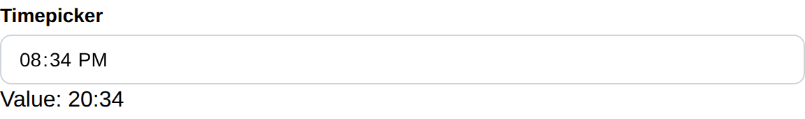

# Timepicker

Timepicker create a timepicker and return its selected time.

## API

```go
type Time struct {
	Hour int
	Min  int
}

func Timepicker(c *tgframe.Container, label string, conf ...*TimepickerConf) *Time
```

* `c` is Parent container.
* `label` is the label for timepicker.
* `conf` is an optional configuration, at most one.
* Return the selected time. nil if no time is selected.

```go
// TimepickerConf is the configuration for the Timepicker component.
type TimepickerConf struct {
	tgframe.Base // ID
}
```

## Example

```go
timeValue := tgcomp.Timepicker(p.Main, "Timepicker")
if timeValue != nil {
	text := fmt.Sprintf("Value: %02d:%02d", timeValue.Hour, timeValue.Min)
	tgcomp.Text(p.Main, text, &tgcomp.TextConf{ID: "timepicker_result"})
}
```


