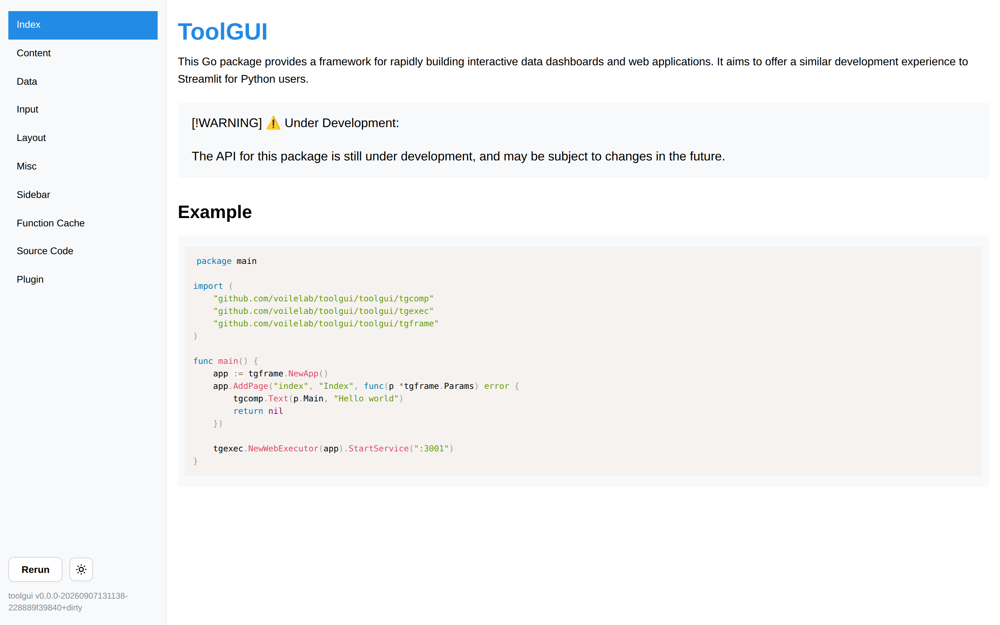

# ToolGUI

This Go package provides a framework for rapidly building interactive data
dashboards and web applications. It aims to offer a similar development
experience to Streamlit for Python users.

> ⚠️ Under Development:
> 
> The API for this package is still under development,
> and may be subject to changes in the future.

## Live demo

**[Open the component demo in your browser](demo/)** — the demo app covering
every component, compiled to WebAssembly, with no server behind it.

The same app runs locally with `task run_demo`, at http://localhost:3000.

